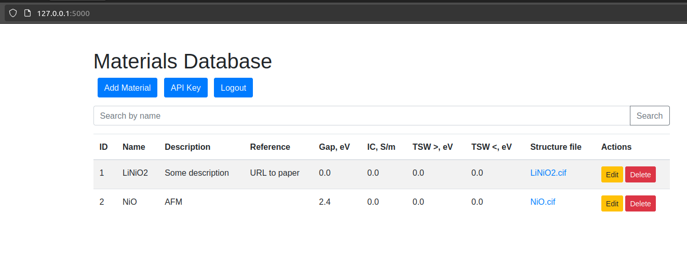

# Database for solid state batteries discovery

----

API:
```
from apitest import interface
```
Generate API key after login

```
user='username'
api='yourapikey'
remote_database=interface(user=user,api_key=api)
```
Pull info about materials:
```
remote_database.get_materials()
```
```
Materials retrieved successfully:
ID: 1, Name: LiNiO2, Gap: 0.0
ID: 2, Name: NiO, Gap: 2.4
ID: 3, Name: Test, Gap: 1.0
```
Or push back:
```
remote_database.add_material(data=dict(
    name='Test',
    description='Test',
    gap=1,
    ionc=0,
    tsw_up=0,
    tsw_down=0,
    filename='',
))
```
You can also directly download structure file:
```
remote_database.download_structure(material_id=2)
```
----

Security:
 -have login page, anyone can register (for now)

---
Workflow and Logic
```
+-------------------+
|  User Interface   |
| (Web Browser)     |
+---------+---------+
          |
          v
+---------+---------+
|    Flask App      |
| - Routes          |
| - Logic           |
+---------+---------+
          |
          v
+---------+---------+
|    Database       |
| (SQLite)         |
+---------+---------+
          |
          v
+---------+---------+
|  File Storage     |
| (uploads folder)  |
+---------+---------+
          |
          v
+---------+---------+
|    API Access     |
| - Generate API Key|
| - Retrieve Materials|
+---------+---------+
          |
          v
+---------+---------+
| Nginx (Reverse    |
| Proxy)            |
+---------+---------+
          |
          v
+---------+---------+
| Gunicorn (WSGI    |
| Server)           |
+-------------------+
```
